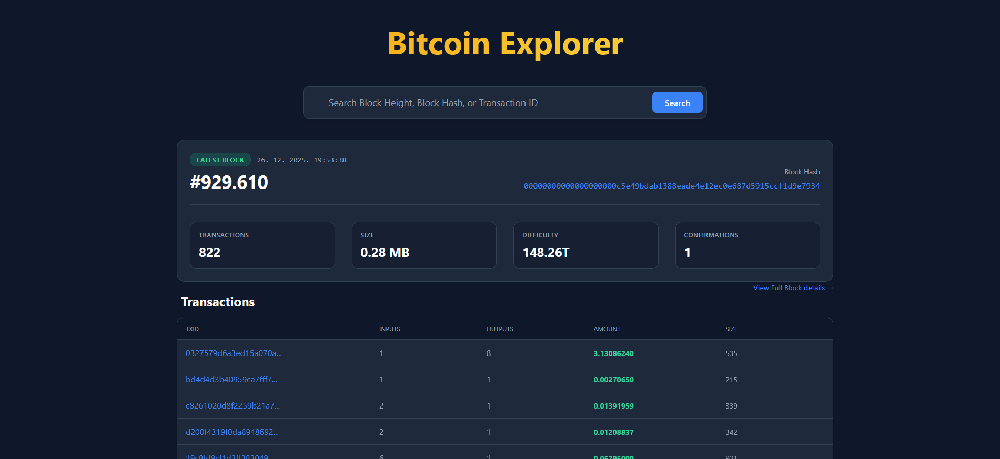
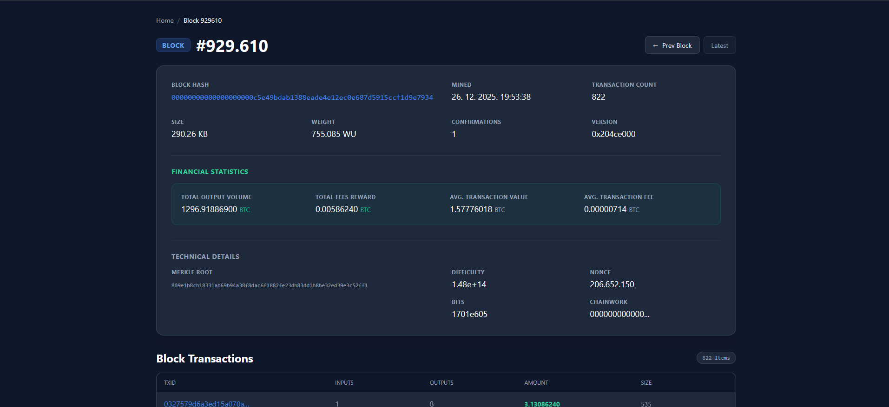
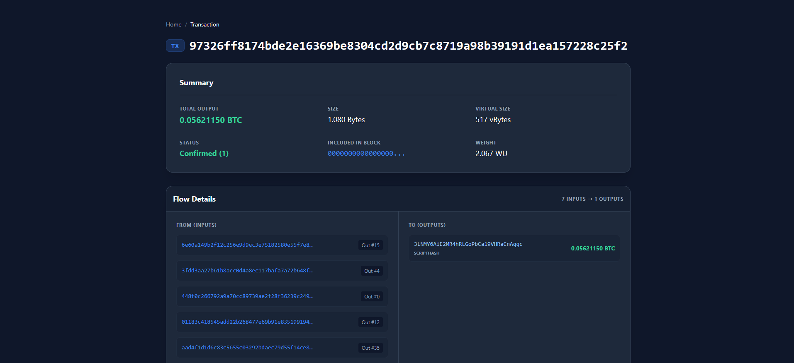

# ₿ Bitcoin Explorer

   

A full-stack Bitcoin Block Explorer built with **React** and **Fastify**. It connects directly to a Bitcoin Core node via RPC to provide real-time blockchain data, financial statistics, and deep insights into blocks and transactions.

The application features a modern dark UI, virtualized tables for handling massive datasets, and detailed financial analytics for every block.

---

## 📸 Screenshots

### 1. Home Dashboard

_Real-time network status with the latest block feed and search functionality._



<!-- Create a folder named 'screenshots' in your root and add images there -->

### 2. Block Details

_Comprehensive breakdown of block data including volume, fees, and virtualized transaction list._



### 3. Transaction Details

_Deep dive into transaction inputs, outputs, scripts, and witness data._



---

## 🚀 Features

- **⚡ Real-time Data:** Fetches the latest blocks directly from your Bitcoin node.
- **📊 Financial Stats:** Auto-calculates total block volume, miner fees, and average transaction values.
- **🚅 High Performance:** Uses virtualization (`@tanstack/react-virtual`) to render blocks with 3000+ transactions smoothly without lag.
- **🔍 Search Engine:** Instantly lookup blocks by Hash/Height and transactions by ID.
- **🌑 Dark Mode:** Professional, developer-friendly dark interface using Tailwind CSS.
- **🛡️ Type Safe:** Built entirely with TypeScript for robustness and reliability.

---

## 🛠️ Tech Stack

### Frontend

- **Framework:** React 19 (Vite)
- **State Management:** TanStack Query (React Query)
- **UI/Styling:** Tailwind CSS
- **Components:** TanStack Table (Virtualization), React Router

### Backend (Proxy)

- **Server:** Fastify (Node.js)
- **Bitcoin RPC:** bitcoin-core (Native RPC Client)
- **Tools:** Dotenv, CORS

---

## ⚙️ Prerequisites

Before you begin, ensure you have the following installed:

- **Node.js** (v18 or higher)
- **Bitcoin Core Node** (Running locally or remotely with RPC enabled)

> **Note:** Your `bitcoin.conf` must allow RPC connections. Example:
>
> ```
> server=1
> rpcuser=youruser
> rpcpassword=yourpassword
> rpcallowip=127.0.0.1
> txindex=1
> ```
>
> _`txindex=1` is required to look up arbitrary transactions._

---

## 📦 Installation & Setup

### 1. Clone the Repository

```
git clone https://github.com/MarinSop/bitcoin-blockchain-explorer.git
cd bitcoin-blockchain-explorer
```

### 2. Backend Setup (Proxy)

Navigate to the proxy directory and install dependencies.

```
cd proxy
npm install
```

Create a `.env` file in the `proxy` folder:

```
# Server Port
PORT=3000

# Bitcoin Core RPC Credentials
BITCOIN_RPC_URL=http://127.0.0.1:8332
BITCOIN_RPC_USER=your_rpc_user
BITCOIN_RPC_PASS=your_rpc_password
```

Start the backend server:

```
npm run dev
```

_The server should now be running on `http://localhost:3000`_

### 3. Frontend Setup (App)

Open a new terminal, navigate to the app directory, and install dependencies.

```
cd app
npm install
```

Create a `.env` file in the `proxy` folder:

```
# API URL
VITE_API_URL='http://host:port/api'
```

Start the frontend development server:

```
npm run dev
```

_The app should now be running on `http://localhost:5173`_

---

## 📖 How to Use

1. **Dashboard:** Open the app to see the latest block mined.
2. **Navigation:** Click on the block hash or height to view details.
3. **Search:** Use the search bar to paste a Transaction ID (TXID) or Block Hash/Height.
4. **Analysis:** On the Block page, explore the "Financial Stats" section to see fee markets and volume. Scroll down to see the transaction table load instantly.

## 📄 License

Distributed under the MIT License. See `LICENSE` for more information.
